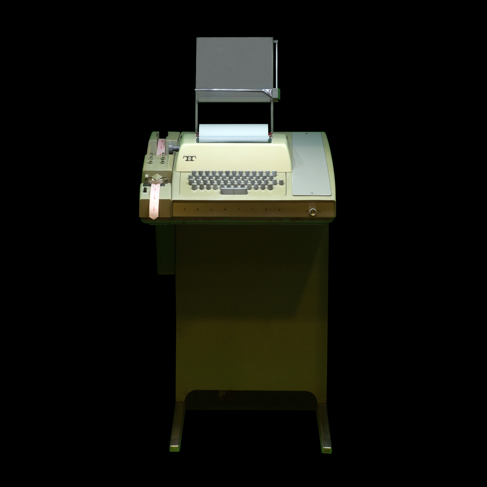
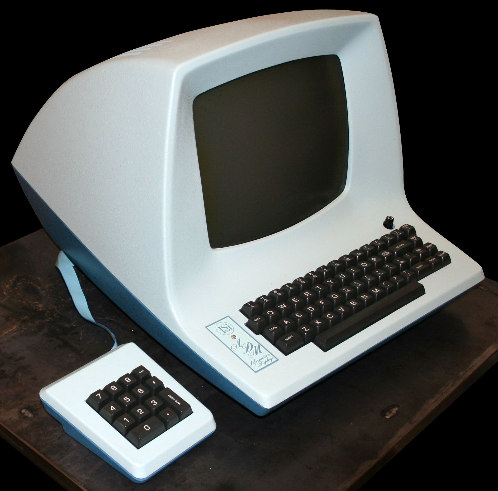
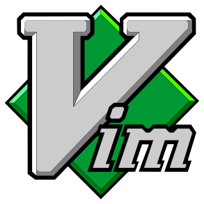
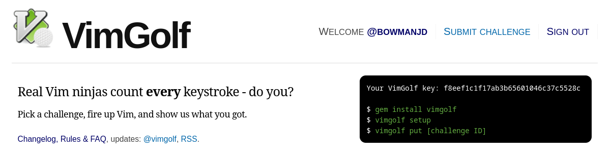
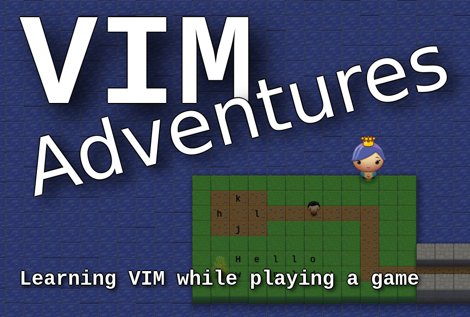

# Try a little Vim

 <!-- .element: class="r-stretch" -->

vim.bowmanjd.com
 <!-- .element: class="r-stretch" style="vertical-align: middle" -->

Notes:

Welcome. I am Jonathan Bowman. I have been using Vim for over 20 years. I know that makes me just a beginner, but you have to start somewhere.

---

 <!-- .element: class="r-stretch" style="vertical-align: middle" -->

Notes:

Story of Admin Assistant looking up and always seeing me still coming. Monty Python. Lots of people love it. But not everyone. _And not everyone has to love it_.

---

## Install Neovim

- [neovim.io](https://neovim.io)
- Download: <!-- .element: class="fragment" --> [github.com/neovim/neovim/releases](https://github.com/neovim/neovim/releases)
- Windows: <!-- .element: class="fragment" --> `scoop install neovim`
- Windows: <!-- .element: class="fragment" --> `winget install Neovim.Neovim`
- Mac:  <!-- .element: class="fragment" --> `brew install neovim`
- Debian/Ubuntu: <!-- .element: class="fragment" --> `apt install neovim`
- Fedora: <!-- .element: class="fragment" --> `dnf install neovim`
- Nix: <!-- .element: class="fragment" --> `nix-shell -p neovim`

---

## Launch Neovim

- Launch a terminal
- `nvim`
- :help <!-- .element: class="fragment" -->
- :Tutor <!-- .element: class="fragment" -->

---

1. History
1. Hooray for Open Source
1. Modes: insert, normal, command...
1. Movement, change, repetition
1. Files
1. Searching
1. Navigating help
1. Extending Neovim
1. Learning Resources
1. Discussion

Notes:

Itinerary of where we are going

---

## vim.bowmanjd.com

 <!-- .element: class="hero" -->

---

## Vim's lineage

 <!-- .element: class="hero" -->

Notes:

An ASR-33 teletype machine first made in 1963. No screen, just paper.

|||

1966: [QED](https://en.wikipedia.org/wiki/Ed_(text_editor)), a line editor<!-- .element: class="r-stretch" -->

|||

1969: [ed](https://en.wikipedia.org/wiki/Ed_(text_editor)), a successor <!-- .element: class="r-stretch" -->

|||

<!-- .slide: data-background-image="assets/ed.gif"  -->

|||

1976: em, the "editor for mortals"

...then en <!-- .element: class="fragment" -->

...maybe eo? <!-- .element: class="fragment" -->

...maybe ep? <!-- .element: class="fragment" -->

|||

1976: [ex](https://en.wikipedia.org/wiki/Ex_%28text_editor%29)

...included in Berkeley Software Distribution (BSD)

|||

# vi

In 1979, ex got a visual mode: vi

...eventually [included in the POSIX spec](https://pubs.opengroup.org/onlinepubs/9699919799/utilities/vi.html)

|||

## Works on a video terminal!

 <!-- .element: class="hero" -->

|||

<!-- .slide: data-background-image="assets/ADM3A.svg" data-background-size="contain"  -->

Notes:

Note where the arrow keys are!

|||

## vi successors

- 1987: [STEVIE](https://timthompson.com/tjt/stevie/) (on the Atari ST)
- 1990: [Elvis](https://en.wikipedia.org/wiki/Elvis_(text_editor))
- 1994: [nvi](https://en.wikipedia.org/wiki/Nvi)

Notes:

None of these are terribly active today

|||

## 1991: <del>Vi Imitation</del> Vi Improved

 <!-- .element: class="r-stretch" -->

Notes:

But this one is. Bram, the original author, wanted something like Stevie on his Amiga 2000, which until then didn't have a vi-like editor for it. (I always wished I had an Amiga 2000).

|||

## Bram Moolenar 1961-2023

 <!-- .element: class="r-stretch" -->

Notes:

Bram pursued what I would call a "benevolent dictator" model of leadership in an open source software project. It was a labor of love. He was a gatekeeper, tending the product. But for some it was like the sign says "You got to have a membership card to get inside" Huh

|||

<!-- .slide: data-background-image="assets/neovim-logo.svg" data-background-size="contain"  -->

Notes:

In 2015, Neovim was released after forking Vim. The reasons for the fork were varied, with primary emphasis on community contribution, modernizing code and structure, and a new plugin system.

I switched to Neovim a few years ago because of the way it integrated with external languages like Python, Ruby, and Javascript, and because of built in support for language servers -- the Language Server Protocol (LSP)

---

<!-- .slide: data-background-image="assets/editors.png" data-background-size="contain"  -->

Notes:

Neovim and Vim together have around a third of the pie. I love that most of these are open source... says something about developer tooling; still trying to put a finger on it...

---

## Open source at its best

- Quality from public scrutiny
- Hospitable community
- No financial barriers
- Relevant features from public contribution and thorough review
- Openly extendable, easy to integrate
- Longevity unencumbered by corporate captivity

Notes:

Open source projects can be dysfunctional, and closed source processes can be healthy. Yet Neovim is an prototypical example of an open source project 

|||

## Collaborate!

- <!-- .element: class="fragment" --> <i class="nf nf-oct-heart"></i> Donate 
- <!-- .element: class="fragment" --> <i class="nf nf-oct-issue_opened"></i> Issues
- <!-- .element: class="fragment" --> <i class="nf nf-oct-book"></i> Documentation
- <!-- .element: class="fragment" --> <i class="nf nf-oct-git_pull_request"></i> Code
- <!-- .element: class="fragment" --> <i class="nf nf-md-stack_exchange"></i> Help

---

# Modes <!-- .element: class="hero" -->

|||

<!-- .slide: data-background-image="assets/bob-ross-insert.jpg" data-background-size="contain"  -->

|||

## Insert mode

- `i` (insert) enters insert mode before the cursor
- `a` (append) enters insert mode after the cursor
- `o` (open new line) new line below current
- `O` (open new line above) new line above current
- `<Esc>` returns to normal mode

|||

<!-- .slide: data-background-image="assets/bob-ross-normal.jpg" data-background-size="contain"  -->

|||

## Normal mode

- Artists spend much of their time as "normal"
- Vim starts in normal mode; `<Esc>` returns
- Things to try:
  - `h`, `j`, `k`, `l` or cursor keys to move
  - `gg` move to top of file; `G` move to bottom or line #
  - `yy` to "yank" (copy) a line
  - `dd` to delete (cut) a line
  - `x` to cut character under the cursor
  - `p` to paste

|||

<!-- .slide: data-background-image="assets/normal.gif" data-background-size="contain"  -->

|||

## Command mode

- `:` enters command mode from normal mode
- Therefore, `<Esc>:` enters command from insert mode
- `:q` will quit Vim 
- `:w` will save the current file
- Commands can be combined, as in `:wq`
- This is Ex mode (line editing)

|||

## Visual mode

- `v` enters visual mode from normal mode
- Make desired selection, the type action
- `V` enters visual mode linewise

|||

<!-- .slide: data-background-image="assets/visual.gif" data-background-size="contain"  -->

|||

## Visual block mode

- `ctrl-v` enters visual block mode
- corners defined by cursor
- select desired block, then type action

|||

<!-- .slide: data-background-image="assets/visualblock.gif" data-background-size="contain"  -->

|||

## Replace mode

- type over existing text
- `R` (shift-r) enters replace mode

---

## Movement

- `h j k l`: left, down, up, right
- cursor keys work fine, too
- `w` and `b` move by word
- `)` and `(` move by sentence
- `}` and `{` move by paragraph
- `f` or `t` followed by character 
- `gg` to top, `G` to end of file
- `100G` or `:100` will go to line 100

|||

<!-- .slide: data-background-image="assets/movement.gif" data-background-size="contain"  -->

---

## Change

- `r` will replace a character with the next typed
- `c` plus a movement will delete then insert
- Example: `ce` to change to the end of the word
- `c$` to change to end of line; `C` is synonymous

---

## Repetition

- `.` repeats a simple change

|||

## Record macros

- `q` followed by register (a-z work great)
- Execute a variety of actions
- press `q` to end the recording
- play back with `@` then the register
- `@@` repeats the last played recording

## Undo

- `u` to undo the last change
- `U` to undo all changes on a line
- `ctrl-r` to redo the last undo
- (undo a `U` with `u`, oddly)

---

## File commands

- `:e filename.txt` opens a file
- `:w` saves the file
- `:w filename.txt` saves to filename
- `:r filename.txt` retrieves file contents

---

## Searching

- `/search term I want to find`
- `/^supports reg[ular ]*ex[presion]*$`
- `*` in normal mode finds next match of word under cursor
- `#` finds previous match of word under cursor
- `n` find the next match, `N` the previous

---

## Search and replace

- `s/war/peace/`
- `s/war/peace/g`
- `%s/war/peace/g`
- `%s/war/peace/gc`

Notes:

- Replace the first occurrence of war in this line with peace
- Replace the all occurrences of war in this line with peace
- Replace the all occurrences of war in this file with peace
- Prompt at each

|||

<!-- .slide: data-background-image="assets/war.gif" data-background-size="contain"  -->

---

## `:help`

Abbreviated `:h`

|||

## Help with Normal mode commands

`:help x`

`:h D`

|||

## Help with Command mode

prefix: `:`

`:h :dig`

`:h :b`

|||

## Help with Insert mode commands

prefix: `i_`

`:h i_ctrl-u`

`:h i_ctrl-k`

|||

## Help with Visual mode commands

prefix: `v_`

`:h v_~`

`:h v_gq`

|||

## Help with config options

prefix: `'`

`:h 'shiftwidth`

`:h 'cursorline`

|||

## Help with regex

prefix: `/`

`:h /\d`

`:h /[`

---

## Extensibility

Neovim is easy to extend through:

- Plugins
- Language Servers
- Customization

|||

## Plugin managers

- [lazy.nvim](https://github.com/folke/lazy.nvim)
- [pckr](https://github.com/lewis6991/pckr.nvim)
- [paq](https://github.com/savq/paq-nvim)
- [vim-plug](https://github.com/junegunn/vim-plug)
- built-in/manually: see `:h plugin`

|||

## LSP integration

- [Language Server Protocol](https://microsoft.github.io/language-server-protocol/)
- Easy LSP configs: [nvim-lspconfig](https://github.com/neovim/nvim-lspconfig)
- Completions: [nvim-cmp](https://github.com/hrsh7th/nvim-cmp)
- [Mason](https://github.com/williamboman/mason.nvim) to manage the external tooling

|||

## Learn Lua for optimal Neovim configuration

- [learnxinyminutes.com/docs/lua](https://learnxinyminutes.com/docs/lua/)
- [`:h lua-guide`](https://neovim.io/doc/user/lua-guide.html) 

|||

## Sample configs

- [kickstart.nvim](https://github.com/nvim-lua/kickstart.nvim)
- [nvim-starter](https://github.com/VonHeikemen/nvim-starter)
- [tinyvim](https://github.com/NvChad/tinyvim)
- [Launch.nvim](https://github.com/LunarVim/Launch.nvim)
- [dope](https://github.com/nvimdev/dope)
- [Ecovim](https://github.com/ecosse3/nvim)

---

## Popular Neovim "distributions"

[NvChad](https://nvchad.com/) <!-- .element: class="fragment" -->

[LazyVim](http://www.lazyvim.org/) <!-- .element: class="fragment" -->

[AstroNvim](https://astronvim.com/) <!-- .element: class="fragment" -->

[LunarVim](https://www.lunarvim.org/) <!-- .element: class="fragment" -->

[vscode-neovim](https://github.com/vscode-neovim/vscode-neovim) <!-- .element: class="fragment" -->

Notes:

For a good out-of-box experience, consider one of these

---

# Learning resources <!-- .element: class="hero" -->

|||

<!-- .slide: data-background-image="assets/Learning-the-vi-and-Vim-Editors.jpg" data-background-size="contain"  -->

|||

<!-- .slide: data-background-image="assets/practical-vim.jpg" data-background-size="contain"  -->

|||

<!-- .slide: data-background-image="assets/modern-vim.jpg" data-background-size="contain"  -->

|||

- ["Getting Started" from the subreddit](https://www.reddit.com/r/neovim/wiki/index/getting-started/)
- [vi.stackexchange.com](https://vi.stackexchange.com/)
- [Awesome Neovim](https://github.com/rockerBOO/awesome-neovim)
- [This Week in Neovim](https://dotfyle.com/this-week-in-neovim)
- [Neovim related projects](https://github.com/neovim/neovim/wiki/Related-projects)
- [dotfyle.com](https://dotfyle.com/)
- [neovimcraft](https://neovimcraft.com/)

|||

- ["The Only Video You Need to Get Started with Neovim" by TJ Devries](https://www.youtube.com/watch?v=m8C0Cq9Uv9o)
- [@teej_dv](https://www.youtube.com/@teej_dv)
- [@ThePrimeagen](https://www.youtube.com/@ThePrimeagen)
- [@bashbunni](https://www.youtube.com/playlist?list=PL3PYGQRVAjrMxP5HK45CTnR7Yv-QYR1Qp)
- [@typecraft_dev](https://www.youtube.com/@typecraft_dev)
- ["Understanding Neovim" by @vhyrro](https://www.youtube.com/watch?list=PLx2ksyallYzW4WNYHD9xOFrPRYGlntAft)
- [@chrisatmachine](https://www.youtube.com/watch?v=ctH-a-1eUME&list=PLhoH5vyxr6Qq41NFL4GvhFp-WLd5xzIzZ)

|||

## VimGolf.com

|||

---

## Interaction

- Questions
- Favorite plugins
- Productive strategies yet unmentioned
- Controversial arguments...

