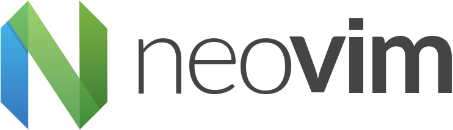

# A Little Vim for You

 <!-- .element: class="r-stretch" -->

vim.bowmanjd.com
 <!-- .element: class="r-stretch" style="vertical-align: middle" -->

Notes:

Welcome. I am Jonathan Bowman. I have been using Vim for over 20 years. I know that makes me just a beginner, but you have to start somewhere.

---

 <!-- .element: class="r-stretch" style="vertical-align: middle" -->

Notes:

Story of Admin Assistant looking up and always seeing me still coming. Monty Python. Lots of people love it. But not everyone. _And not everyone has to love it_.

---

## Install Neovim

- [neovim.io](https://neovim.io)
- Download: <!-- .element: class="fragment" --> [github.com/neovim/neovim/releases](https://github.com/neovim/neovim/releases)
- Windows: <!-- .element: class="fragment" --> `scoop install neovim`
- Windows: <!-- .element: class="fragment" --> `winget install Neovim.Neovim`
- Mac:  <!-- .element: class="fragment" --> `brew install neovim`
- Debian/Ubuntu: <!-- .element: class="fragment" --> `apt install neovim`
- Fedora: <!-- .element: class="fragment" --> `dnf install neovim python3-neovim`
- Nix: <!-- .element: class="fragment" --> `nix-shell -p neovim`

---

## Launch Neovim

- Launch a terminal
- `nvim`
- :h <!-- .element: class="fragment" -->
- :Tutor <!-- .element: class="fragment" -->

---

## Itinerary

- History
- Open Source perks
- Starting and quitting
- Getting around (cursor movement)
- Modes: insert, normal/command, visual, visual block
- Navigating help
- Repetition!
- Links

---

## vim.bowmanjd.com

 <!-- .element: class="hero" -->

---

## Vim's lineage

 <!-- .element: class="hero" -->

Notes:

An ASR-33 teletype machine first made in 1963. No screen, just paper.

|||

1966: [QED](https://en.wikipedia.org/wiki/Ed_(text_editor)), a line editor<!-- .element: class="r-stretch" -->

|||

1969: [ed](https://en.wikipedia.org/wiki/Ed_(text_editor)), a successor <!-- .element: class="r-stretch" -->

|||

<!-- .slide: data-background-image="assets/ed.gif"  -->

|||

1976: em, the "editor for mortals"

...then en <!-- .element: class="fragment" -->

...maybe eo? <!-- .element: class="fragment" -->

...maybe ep? <!-- .element: class="fragment" -->

|||

1976: [ex](https://en.wikipedia.org/wiki/Ex_%28text_editor%29)

...included in Berkeley Software Distribution (BSD)

|||

# vi

In 1979, ex got a visual mode: vi

...eventually [included in the POSIX spec](https://pubs.opengroup.org/onlinepubs/9699919799/utilities/vi.html)

|||

## Works on a video terminal!

 <!-- .element: class="hero" -->

|||

<!-- .slide: data-background-image="assets/ADM3A.svg" data-background-size="contain"  -->

Notes:

Note where the arrow keys are!

|||

## vi successors

- 1987: [STEVIE](https://timthompson.com/tjt/stevie/) (on the Atari ST)
- 1990: [Elvis](https://en.wikipedia.org/wiki/Elvis_(text_editor))
- 1994: [nvi](https://en.wikipedia.org/wiki/Nvi)

Notes:

None of these are terribly active today

|||

## 1991: <del>Vi Imitation</del> Vi Improved

 <!-- .element: class="r-stretch" -->

Notes:

But this one is. Bram, the original author, wanted something like Stevie on his Amiga 2000, which until then didn't have a vi-like editor for it. (I always wished I had an Amiga 2000).

|||

## Bram Moolenar 1961-2023

 <!-- .element: class="r-stretch" -->

Notes:

Bram pursued what I would call a "benevolent dictator" model of leadership in an open source software project. It was a labor of love. Or was it gatekeeping?

|||

<!-- .slide: data-background-image="assets/neovim-logo.svg" data-background-size="contain"  -->

Notes:

In 2015, Neovim was released after forking Vim. The reasons for the fork were varied, with primary emphasis on community contribution, modernizing code and structure, and a new plugin system.

I switched to Neovim a few years ago because of the way it integrated with external languages like Python, Ruby, and Javascript, and because of built in support for language servers -- the Language Server Protocol (LSP)

---

<!-- .slide: data-background-image="assets/editors.png" data-background-size="contain"  -->

---

## LSP integration

- LSP

Notes:

Neovim and Vim together have around a third of the pie. I love that most of these are open source... says something about developer tooling; still trying to put a finger on it...

---

## Collaborate!

- <!-- .element: class="fragment" --> <i class="nf nf-oct-heart"></i> Donate 
- <!-- .element: class="fragment" --> <i class="nf nf-oct-issue_opened"></i> Issues
- <!-- .element: class="fragment" --> <i class="nf nf-oct-book"></i> Documentation
- <!-- .element: class="fragment" --> <i class="nf nf-oct-git_pull_request"></i> Code
- <!-- .element: class="fragment" --> <i class="nf nf-md-stack_exchange"></i> Help

---

- [NvChad](https://nvchad.com/)
- [LazyVim](http://www.lazyvim.org/)
- [AstroNvim](https://astronvim.com/)
- [LunarVim](https://www.lunarvim.org/)
- [kickstart.nvim](https://github.com/nvim-lua/kickstart.nvim)
- [NvPack](https://github.com/EvolveBeyond/NvPak)

---

[learnxinyminutes.com/docs/lua](https://learnxinyminutes.com/docs/lua/)

---

- ["The Only Video You Need to Get Started with Neovim" by TJ Devries](https://www.youtube.com/watch?v=m8C0Cq9Uv9o)
- [@teej_dv](https://www.youtube.com/@teej_dv)
- [@ThePrimeagen](https://www.youtube.com/@ThePrimeagen)
- [@bashbunni](https://www.youtube.com/playlist?list=PL3PYGQRVAjrMxP5HK45CTnR7Yv-QYR1Qp)
- ["Understanding Neovim" by @vhyrro](https://www.youtube.com/watch?list=PLx2ksyallYzW4WNYHD9xOFrPRYGlntAft)
- [@chrisatmachine](https://www.youtube.com/watch?v=ctH-a-1eUME&list=PLhoH5vyxr6Qq41NFL4GvhFp-WLd5xzIzZ)
- [@typecraft_dev](https://www.youtube.com/@typecraft_dev)

---

- [Ruby on Rails creator DHH switching to Neovim](https://world.hey.com/dhh/finding-the-last-editor-dae701cc)

- [vi.stackexchange.com](https://vi.stackexchange.com/)
- [Awesome Neovim](https://github.com/rockerBOO/awesome-neovim)
